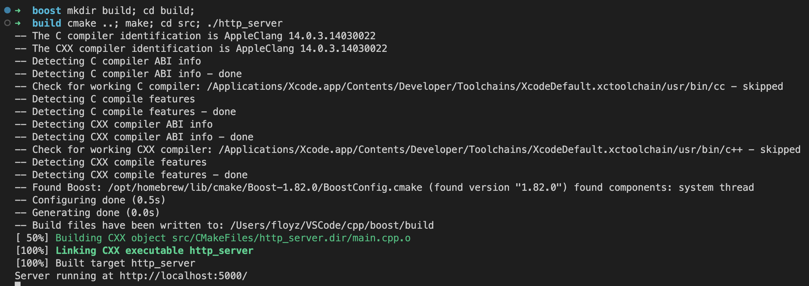

# RESTfull API using Boost.Asio and Boost.Beast with Boost.property_tree.json_parser

- run server:
```shell
cd server
vcpkg install boost-asio
vcpkg install boost
mkdir build
cd build
cmake ..
make
web_api```

or

```shell
bash run.sh
```


---

- run client:
```shell
cd client
npm i
npm start
```

or

```shell
bash run.sh
```